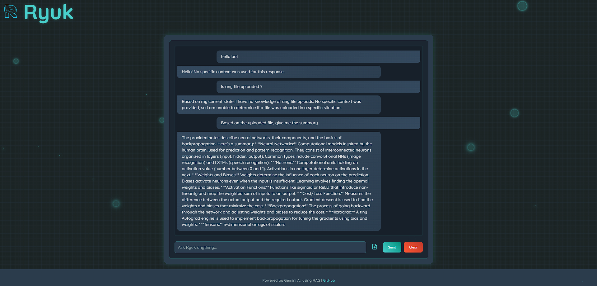

# Ryuk Chatbot

Ryuk is an AI-powered chatbot built using Flask, Gemini AI, and Retrieval-Augmented Generation (RAG) techniques. It allows users to upload documents (PDF, DOCX, TXT) and ask questions based on the content of those documents, with the chatbot providing context-aware responses. The project features a sleek, futuristic UI with glowing animations, a responsive chat interface, and robust document processing capabilities.

## Features

* **Document Upload and Processing:** Upload PDF, DOCX, or TXT files, which are processed into chunks and embedded using Sentence Transformers for context-aware responses.
* **Context-Aware Chat:** Ask questions based on uploaded documents, and the chatbot retrieves relevant context using cosine similarity and embeddings.
* **Gemini AI Integration:** Leverages Google's Gemini AI for generating natural language responses.
* **Futuristic UI:** A dark-themed interface with glowing stars, floating bubbles, and a minimal loading animation.
* **Responsive Design:** Works seamlessly across devices with a flexible layout.
* **Clear Chat Functionality:** Easily clear the chat history and uploaded documents.
* **Error Handling:** Robust logging and error handling for file processing and API calls.

## Technologies Used

### Backend

* **Flask:** Lightweight web framework.
* **Google Generative AI (Gemini):** For generating context-based responses.
* **Sentence Transformers:** `all-MiniLM-L6-v2` for text embeddings.
* **PyPDF2:** For PDF text extraction.
* **python-docx:** For DOCX text extraction.
* **NumPy and scikit-learn:** For cosine similarity computations.
* **python-dotenv:** For managing environment variables.
* **Logging:** For error tracking and debugging.

### Frontend

* **HTML/CSS/JavaScript:** Core UI and logic.
* **Quicksand Font:** From Google Fonts.
* **Custom Animations:** Glowing stars, bubbles, and three-dot wave loader.

### Other Tools

* **Git and GitHub:** Version control and repository hosting.
* **Python Virtual Environment:** Dependency management.

## Project Structure

```
Ryuk-Chatbot/
├── app.py                 # Main Flask application
├── requirements.txt       # Python dependencies
├── static/
│   ├── css/
│   │   └── style.css      # UI styles and animations
│   └── js/
│       └── script.js      # Chat functionality
├── templates/
│   └── index.html         # Main HTML interface
└── README.md              # Project documentation
```

## How It Works

### 1. Document Processing and Embedding

* **File Upload:** PDF, DOCX, or TXT via `/upload` endpoint.
* **Text Extraction:**

  * PyPDF2 for PDFs.
  * python-docx for DOCX.
  * UTF-8 or Latin-1 reading for TXT.
* **Chunking:** Text is split into 1000-character chunks.
* **Embedding:** Chunks are embedded using `all-MiniLM-L6-v2`.

### 2. Context Retrieval

* **Query Embedding:** User question is embedded similarly.
* **Cosine Similarity:** Compared against chunk embeddings.
* **Top 3 Chunks:** Retrieved if similarity > 0.1.
* **Summary Requests:** Use full document.

### 3. Response Generation

* **Prompt:** Built using context + user query.
* **Gemini AI:** Response generated via Gemini API (`gemini-1.5-flash`).
* **Markdown Response:** Displayed in chat.

### 4. Frontend Interaction

* **Chat Interface:** Send questions via text input.
* **Loading Animation:** Three-dot wave.
* **Dynamic Update:** Scrolls and appends messages.
* **Clear Chat:** Resets chat and uploaded docs.

## Screenshots



## Prerequisites

* Python 3.8 or higher
* Git
* Gemini API key (via Google Cloud)

## Setup Instructions

### Clone the Repository

```bash
git clone https://github.com/VisvaV/Ryuk-Chatbot.git
cd Ryuk-Chatbot
```

### Create Virtual Environment

```bash
python -m venv venv 
venv\Scripts\activate
```

### Install Dependencies

```bash
pip install -r requirements.txt
```

### Configure Environment Variables

```bash
echo "GEMINI_API_KEY=your_api_key_here" > .env
```

Replace `your_api_key_here` with your actual Gemini API key.

### Run the Application

```bash
python app.py
```

Visit: [http://localhost:5000](http://localhost:5000)

## Usage

### Upload a Document

* Click the paperclip icon.
* Select a valid document (PDF, DOCX, or TXT).
* Confirmation appears upon success.

### Ask a Question

* Enter question (e.g., "Summarize the document").
* Click Send or press Enter.

### Clear Chat

* Click "Clear" to reset everything.

## Implementation Details

### Backend (app.py)

* Flask config with 16MB file limit.
* Routes:

  * `/` - Main page
  * `/upload` - Upload handler
  * `/chat` - Chat query handler
  * `/clear` - Clear chat/documents
* Document parsing and embedding logic.

### Frontend (index.html, style.css, script.js)

* HTML layout with chat, input, and buttons.
* CSS dark theme with neon elements.
* JavaScript manages chat updates and AJAX requests.

## Limitations

* **In-Memory Storage:** Embeddings lost on restart.
* **File Size Limit:** 16MB maximum.
* **Gemini Dependency:** Requires API key and internet.
* **No Authentication:** No user login or sessions.

## Future Improvements

* Add database for persistent embeddings.
* Implement login system.
* Support more file types (e.g., images with OCR).
* UI theme customization.
* Better error display to users.

## Contributing

1. Fork the repository.
2. Create a branch: `git checkout -b feature-name`
3. Commit changes: `git commit -m "Add feature-name"`
4. Push: `git push origin feature-name`
5. Open a pull request with details.

## License

This project is licensed under the MIT License. See the LICENSE file for details.
